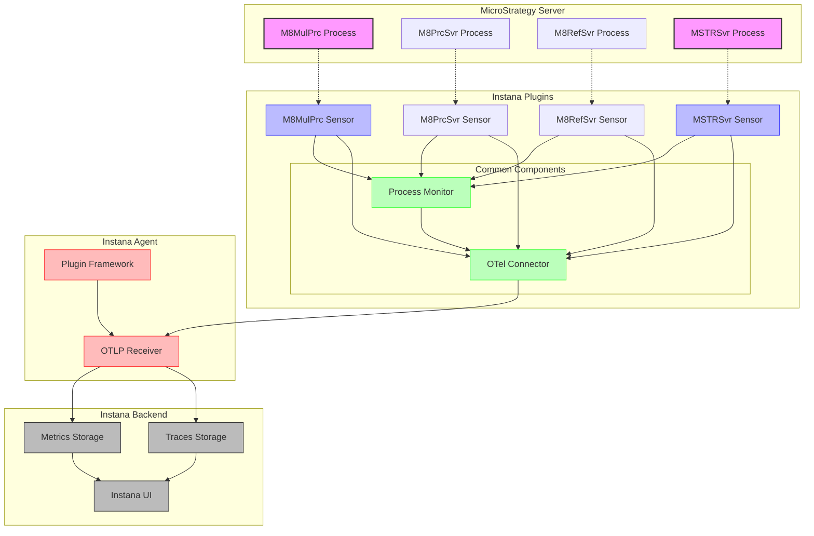

# Instana Plugins Collection

A collection of custom plugins for Instana monitoring of MicroStrategy processes.
A collection of custom plugins for Instana monitoring of MicroStrategy processes.

## Available Plugins

- [M8MulPrc Plugin](m8mulprc/README.md) - Monitor MicroStrategy M8MulPrc processes
- [M8PrcSvr Plugin](m8prcsvr/README.md) - Monitor MicroStrategy M8PrcSvr processes
- [M8RefSvr Plugin](m8refsvr/README.md) - Monitor MicroStrategy M8RefSvr processes
- [MSTRSvr Plugin](mstrsvr/README.md) - Monitor MicroStrategy Intelligence Server processes

## Features

- Process-specific monitoring for MicroStrategy components
- Case-insensitive process detection
- Process resource usage tracking
- OpenTelemetry integration for metrics and traces
- Easy installation with automatic configuration

## Common Metrics Collected

- CPU Usage
- Memory Usage
- Process Count
- Disk Read/Write Bytes
- Open File Descriptors
- Thread Count
- Voluntary/Non-voluntary Context Switches

## Architecture Diagram



## Requirements

- Instana Agent 1.2.0 or higher
- Python 3.6 or higher
- OpenTelemetry Python packages:

  ```bash
  pip install opentelemetry-api opentelemetry-sdk opentelemetry-exporter-otlp
  ```

- MicroStrategy environment

## Installation

Each plugin has its own installation script and documentation. Navigate to the specific plugin directory for detailed instructions.

```bash
# Clone the repository
git clone https://github.com/laplaque/instana_plugins.git
cd instana_plugins

# Install specific plugins with default settings
cd m8mulprc
sudo ./install-instana-m8mulprc-plugin.sh

# Or for M8PrcSvr
cd ../m8prcsvr
sudo ./install-instana-m8prcsvr-plugin.sh

# Or for M8RefSvr
cd ../m8refsvr
sudo ./install-instana-m8refsvr-plugin.sh

# Or for MSTRSvr
cd ../mstrsvr
sudo ./install-instana-mstrsvr-plugin.sh
```

### Installation Options

All plugin installation scripts now support the following command-line options:

- `-d, --directory DIR` : Specify a custom installation directory

  ```bash
  # Example: Install to a custom directory
  sudo ./install-instana-m8mulprc-plugin.sh -d /path/to/custom/directory
  ```

- `-r, --restart` : Start the service immediately after installation

  ```bash
  # Example: Install and start the service
  sudo ./install-instana-m8refsvr-plugin.sh -r
  ```

- `-h, --help` : Show help message and exit

  ```bash
  # Example: Show help message
  ./install-instana-m8prcsvr-plugin.sh --help
  ```

### Permissions and Elevated Rights

The installation scripts require elevated privileges (sudo) to:

1. Copy files to the Instana agent directory (typically `/opt/instana/agent/plugins/custom_sensors/`)
2. Set appropriate permissions for the plugin files
3. Create and enable systemd service files for automatic startup

#### Running Without Elevated Rights

If you prefer to avoid using sudo, you can manually install the plugins:

1. Ensure the Instana agent is running with the same user as your application
2. Create a custom sensors directory in a location accessible by your user:

   ```bash
   mkdir -p ~/instana-plugins/custom_sensors
   ```

3. Copy the plugin files to this directory:

   ```bash
   cp -r m8mulprc ~/instana-plugins/custom_sensors/
   cp -r common ~/instana-plugins/custom_sensors/
   ```

4. Configure the Instana agent to receive OpenTelemetry data by ensuring the following is in your `configuration.yaml` (enabled by default in Instana agent version 1.1.726 or higher):

   ```yaml
   com.instana.plugin.opentelemetry:
     grpc:
       enabled: true
     http:
       enabled: true
   ```

5. Create a user-level systemd service or use cron to start the sensor:

   ```bash
   # Example crontab entry to run every minute
   * * * * * env PYTHONPATH=/home/yourusername/instana-plugins/custom_sensors /home/yourusername/instana-plugins/custom_sensors/m8mulprc/sensor.py
   ```

#### Reducing Required Permissions

To minimize the permissions needed:

- Run the Instana agent as the same user that runs your MicroStrategy processes
- Configure the agent to allow non-root access to its directories
- Use Linux capabilities instead of full root access:

  ```bash
  sudo setcap cap_dac_read_search,cap_sys_ptrace+ep /path/to/sensor.py
  ```

## Architecture

The plugins use a common framework for process monitoring and OpenTelemetry integration:

- `common/process_monitor.py` - Core process metrics collection
- `common/otel_connector.py` - OpenTelemetry integration for Instana
- `common/logging_config.py` - Centralized logging configuration
- `common/base_sensor.py` - Common sensor functionality

Each plugin implements a sensor that uses these common components to monitor specific MicroStrategy processes.

## Scheduling and Frequency

The plugins can be scheduled to run in different ways:

1. **Systemd Service (Default)**: When installed with the provided scripts, the plugins are set up as systemd services that run continuously.
   - The service monitors processes at a default interval of 60 seconds
   - This interval can be adjusted in the systemd service file

2. **Custom Scheduler**: You can create your own scheduling mechanism using:
   - A custom systemd timer
   - A more sophisticated cron job with specific timing
   - A custom script that manages execution frequency

3. **Cron Job**: For non-root installations, a cron job can be used:

   ```bash
   # Run every minute
   * * * * * env PYTHONPATH=/path/to/sensors /path/to/sensors/m8mulprc/sensor.py
   
   # Run every 5 minutes
   */5 * * * * env PYTHONPATH=/path/to/sensors /path/to/sensors/m8mulprc/sensor.py
   ```

4. **Manual/One-time Execution**: Run with the `--run-once` flag for a single execution:

   ```bash
   /opt/instana/agent/plugins/custom_sensors/microstrategy_m8mulprc/sensor.py --run-once
   ```

### Recommended Scheduling Frequencies

- **Production environments**: Every 30-60 seconds
- **Development/Testing**: Every 5-15 seconds for more detailed data
- **Resource-constrained systems**: Every 5 minutes to reduce overhead
- **High-load MicroStrategy servers**: Every 1-2 minutes to balance monitoring with performance

The optimal frequency depends on your monitoring needs and system resources. More frequent collection provides better visibility but increases overhead.

### OpenTelemetry Integration

These plugins use OpenTelemetry (OTel) to send metrics and traces to Instana:

1. **Data Flow**:
   - Metrics are collected by the process monitor
   - The OTel connector exports data via OTLP (OpenTelemetry Protocol)
   - The Instana Agent receives data on port 4317 (gRPC) or 4318 (HTTP) by default
   - Data is forwarded to the Instana backend for visualization

2. **Configuration**:
   - By default, plugins connect to the Instana Agent at `localhost:4317` using gRPC
   - You can customize the agent host and port when initializing the plugins
   - Resource attributes identify the service and host in Instana

3. **Metrics Collected via OTel**:
   - All process metrics are sent as OpenTelemetry gauge metrics
   - Spans are created to track metric collection operations
   - Host and process information are attached as resource attributes

4. **Enabling OpenTelemetry Data Ingestion in Instana Agent**:
   - For Instana Agent version 1.1.726 or higher, OpenTelemetry data ingestion is enabled by default
   - For older versions, add the following to your agent's `configuration.yaml` file:

     ```yaml
     com.instana.plugin.opentelemetry:
       grpc:
         enabled: true
       http:
         enabled: true
     ```

   - The Instana Agent will listen on ports 4317 (gRPC) and 4318 (HTTP/HTTPS)
   - By default, the agent listens only on localhost (127.0.0.1)

5. **TLS Encryption for OpenTelemetry**:
   - The plugins support secure TLS connections to the Instana agent
   - To enable TLS, the Instana agent must be configured with certificates in `<agent_installation>/etc/certs/`
   - The plugins can be configured with the following TLS options:
     - `use_tls`: Enable TLS encryption (default: False)
     - `ca_cert_path`: Path to CA certificate for server verification
     - `client_cert_path`: Path to client certificate for mutual TLS
     - `client_key_path`: Path to client key for mutual TLS
   - When TLS is enabled, the endpoint URL is automatically prefixed with `https://`
   - Environment variables can be used to configure TLS:

     ```bash
     USE_TLS=true
     CA_CERT_PATH=/path/to/ca.crt
     CLIENT_CERT_PATH=/path/to/client.crt
     CLIENT_KEY_PATH=/path/to/client.key
     ```

6. **Kubernetes Configuration**:
   - When using the Instana Agent in Kubernetes, use the service endpoint:
     - OTLP/gRPC: `instana-agent.instana-agent:4317`
     - OTLP/HTTP: `http://instana-agent.instana-agent:4318`
   - Or use the host IP directly with environment variables:

     ```yaml
     env:
       - name: INSTANA_AGENT_HOST
         valueFrom:
           fieldRef:
             apiVersion: v1
             fieldPath: status.hostIP
       - name: TRACER_EXPORTER_OTLP_ENDPOINT
         value: http://$(INSTANA_AGENT_HOST):4317
     ```

> **Note**: The `com.instana.plugin.python` configuration is no longer needed when using the OpenTelemetry interface. The plugins communicate directly with the Instana agent's OpenTelemetry endpoints.

For custom OpenTelemetry configuration, modify the agent host and port parameters when calling the monitoring functions.

## Logging

The plugins use Python's built-in logging framework with a centralized configuration:

1. **Configuration**:
   - Logging is configured through `common/logging_config.py`
   - Default log level is INFO, but can be customized
   - Logs are written to both console and a log file (default: `app.log`)

2. **Log Levels**:
   - ERROR: Critical failures that prevent the plugin from functioning
   - WARNING: Issues that don't prevent operation but require attention
   - INFO: Normal operational information (default)
   - DEBUG: Detailed information for troubleshooting

3. **Customizing Logging**:
   - Set the log level with the `--log-level` command line argument:

     ```bash
     ./sensor.py --log-level=DEBUG
     ```

   - Environment variables can also be used to configure logging:

     ```bash
     export LOG_LEVEL=DEBUG
     export LOG_FILE=/var/log/instana/m8mulprc.log
     ```

4. **Log File Rotation**:
   - Log files are automatically rotated to prevent excessive disk usage
   - Default rotation: 5 MB maximum size, keeping 3 backup files
   - Rotation settings can be adjusted in `logging_config.py`

5. **Log Format**:
   - Timestamp in ISO format
   - Module/component name
   - Log level
   - Message content
   - Example: `2025-04-22 14:30:45,123 - m8mulprc.sensor - INFO - Starting M8MulPrc monitoring`

## Testing

The project includes a comprehensive test suite to ensure reliability:

### Verifying Installation

After installing one or more plugins, you can verify that the installation was successful using the test_installation.py script:

```bash
# Run the installation test
cd tests
./test_installation.py

# Test only a specific plugin
./test_installation.py --plugin m8mulprc

# Check only the dependencies
./test_installation.py --dependencies-only
```

This test script will:
1. Check if all required dependencies are installed
2. Find plugin installations in standard locations
3. Test each installed plugin to verify it works correctly
4. Provide a summary of the test results

For more details on testing your installation, see the [Tests README](tests/README.md).

### Running Unit Tests

```bash
# Run all tests
cd tests
python run_tests.py
   
# Run with coverage report (requires coverage package)
python -m coverage run -m unittest discover
python -m coverage report
   
# Run specific test file
python -m unittest tests/test_logging_config.py
   
# Run all tests with unittest discover
python -m unittest discover tests
```

2. **Test Components**:
   - Unit tests for all core modules
   - Mock classes for external dependencies
   - TLS configuration tests
   - Integration tests for OpenTelemetry

3. **Test Environment**:
   - Tests can run without an actual Instana agent
   - Mock classes simulate OpenTelemetry behavior
   - Environment variables can configure test behavior

4. **Adding New Tests**:
   - Follow the existing pattern in the `tests/` directory
   - Use unittest's assertion methods
   - Mock external dependencies
   - Test both success and failure paths

## Troubleshooting

### Common Issues

1. **Missing Dependencies**:
   - If you see `ModuleNotFoundError` or `ImportError`, install the required packages:

     ```bash
     pip install opentelemetry-api opentelemetry-sdk opentelemetry-exporter-otlp coverage
     ```

2. **Resource Warnings in Tests**:
   - Resource warnings about unclosed files are expected during tests and can be ignored
   - These occur when testing file handlers and are cleaned up by the test tearDown method

3. **Permission Errors**:
   - When running as a non-root user, you may see permission errors accessing `/proc` files
   - Solution: Run with elevated privileges or modify the process monitoring to handle permission errors gracefully

4. **OpenTelemetry Connection Issues**:
   - If metrics aren't appearing in Instana, check:
     - Instana agent is running (`systemctl status instana-agent`)
     - Agent is configured for OpenTelemetry (`grep opentelemetry /opt/instana/agent/etc/instana/configuration.yaml`)
     - No firewall is blocking port 4317
     - Try running with `--log-level=DEBUG` for more detailed connection information

5. **Test Failures**:
   - If tests fail with `AssertionError`, check that your environment matches the expected test conditions
   - Some tests may need to be adjusted for your specific environment
   - Use the `-v` flag with unittest for more verbose output: `python -m unittest -v tests/test_logging_config.py`

6. **Log File Issues**:
   - If log files aren't being created, check directory permissions
   - Try specifying an absolute path with `--log-file=/path/to/logfile.log`
   - For systemd services, ensure the user running the service has write permissions to the log directory

## Known Limitations and Edge Cases

1. **Process Detection Limitations**:
   - The plugin relies on the `ps` command and regex matching to find processes
   - Process names that are very similar may both be detected (e.g., "MSTRSvr" and "MSTRSvrMonitor")
   - Very short-lived processes might be missed between collection intervals

2. **Resource Usage**:
   - On systems with many processes, the monitoring itself consumes some resources
   - Collection intervals shorter than 15 seconds may impact performance on busy systems
   - Memory usage increases with the number of monitored processes

3. **Metric Collection Edge Cases**:
   - If a process restarts between collections, cumulative metrics like disk I/O will reset
   - Process IDs may change between collections if processes restart
   - Some metrics may be unavailable on certain Linux distributions or container environments

4. **OpenTelemetry Limitations**:
   - The OpenTelemetry protocol has a maximum message size (default 4MB)
   - Very large metric batches may be dropped if they exceed size limits
   - Network interruptions between the plugin and Instana agent can cause metric loss
   - TLS certificate validation may fail if system time is incorrect

5. **Containerized Environments**:
   - In containerized environments, some `/proc` metrics may be container-specific rather than host-wide
   - When running in Kubernetes, process metrics may be limited by container boundaries
   - Docker containers may require additional privileges to access host process information

6. **High Availability Setups**:
   - In HA MicroStrategy environments with multiple servers, each server needs its own plugin instance
   - The plugin doesn't automatically discover or monitor new MicroStrategy instances
   - Manual configuration is needed when adding new servers to the environment

## Release Notes

For a detailed history of changes and improvements, see the [Release Notes](RELEASE_NOTES.md).

## License

[MIT License](LICENSE)

Copyright © 2025 laplaque/instana_plugins Contributors
