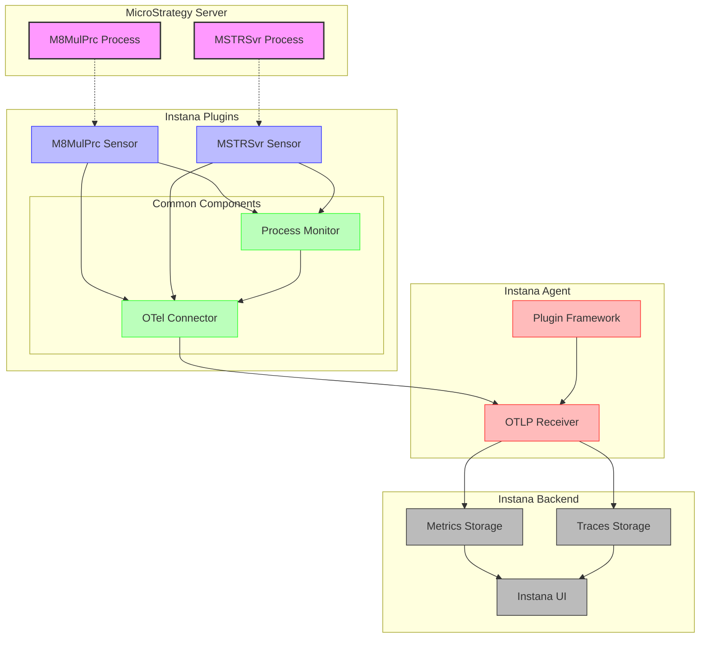

# Instana Plugins Collection

A collection of custom plugins for Instana monitoring of MicroStrategy processes.

## Available Plugins

- [M8MulPrc Plugin](m8mulprc/README.md) - Monitor MicroStrategy M8MulPrc processes
- [MSTRSvr Plugin](mstrsvr/README.md) - Monitor MicroStrategy Intelligence Server processes

## Features

- Process-specific monitoring for MicroStrategy components
- Case-insensitive process detection
- Process resource usage tracking
- OpenTelemetry integration for metrics and traces
- Easy installation with automatic configuration

## Common Metrics Collected

- CPU Usage
- Memory Usage
- Process Count
- Disk Read/Write Bytes
- Open File Descriptors
- Thread Count
- Voluntary/Non-voluntary Context Switches

## Architecture Diagram



## Requirements

- Instana Agent 1.2.0 or higher
- Python 3.6 or higher
- OpenTelemetry Python packages
- MicroStrategy environment

## Installation

Each plugin has its own installation script and documentation. Navigate to the specific plugin directory for detailed instructions.

```bash
# Clone the repository
git clone https://github.com/laplaque/instana_plugins.git
cd instana_plugins

# Install specific plugins
cd m8mulprc
sudo ./install-instana-m8mulprc-plugin.sh

# Or for MSTRSvr
cd ../mstrsvr
sudo ./install-instana-mstrsvr-plugin.sh
```

## Architecture

The plugins use a common framework for process monitoring and OpenTelemetry integration:

- `common/process_monitor.py` - Core process metrics collection
- `common/otel_connector.py` - OpenTelemetry integration for Instana

Each plugin implements a sensor that uses these common components to monitor specific MicroStrategy processes.

## License

[MIT License](LICENSE)

Copyright © 2025 laplaque/instana_plugins Contributors
