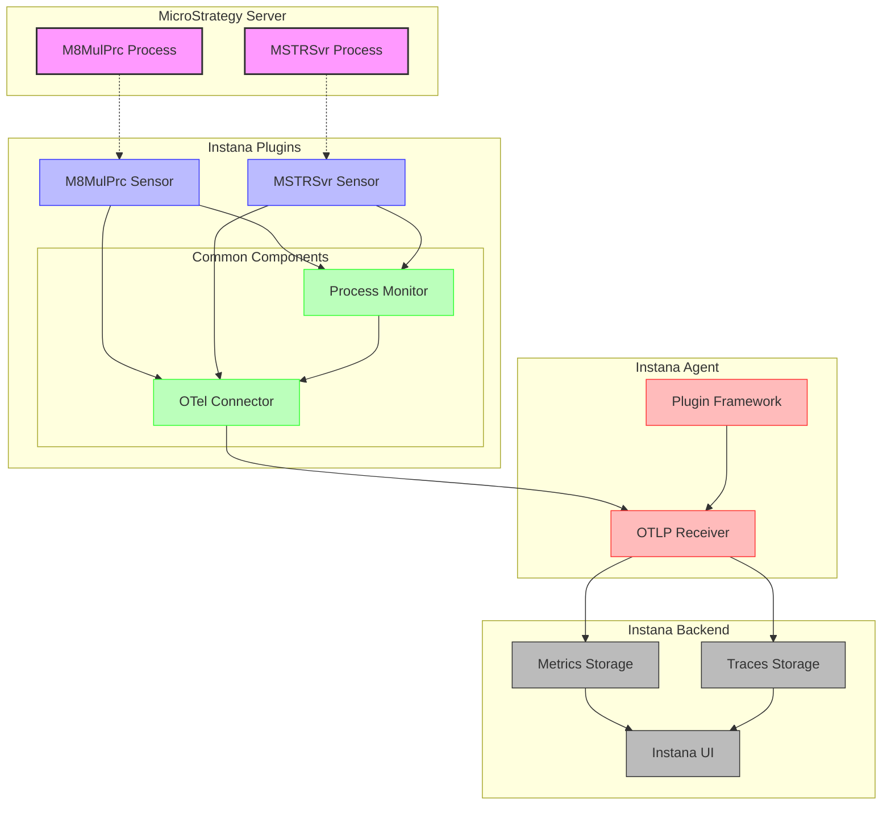

# Instana Plugins Collection

A collection of custom plugins for Instana monitoring of MicroStrategy processes.
A collection of custom plugins for Instana monitoring of MicroStrategy processes.

## Available Plugins

- [M8MulPrc Plugin](m8mulprc/README.md) - Monitor MicroStrategy M8MulPrc processes
- [MSTRSvr Plugin](mstrsvr/README.md) - Monitor MicroStrategy Intelligence Server processes

## Features

- Process-specific monitoring for MicroStrategy components
- Case-insensitive process detection
- Process resource usage tracking
- OpenTelemetry integration for metrics and traces
- Easy installation with automatic configuration

## Common Metrics Collected

- CPU Usage
- Memory Usage
- Process Count
- Disk Read/Write Bytes
- Open File Descriptors
- Thread Count
- Voluntary/Non-voluntary Context Switches

## Architecture Diagram



## Requirements

- Instana Agent 1.2.0 or higher
- Python 3.6 or higher
- OpenTelemetry Python packages
- MicroStrategy environment

## Installation

Each plugin has its own installation script and documentation. Navigate to the specific plugin directory for detailed instructions.

```bash
# Clone the repository
git clone https://github.com/laplaque/instana_plugins.git
cd instana_plugins

# Install specific plugins
cd m8mulprc
sudo ./install-instana-m8mulprc-plugin.sh

# Or for MSTRSvr
cd ../mstrsvr
sudo ./install-instana-mstrsvr-plugin.sh
```

## Architecture

The plugins use a common framework for process monitoring and OpenTelemetry integration:

- `common/process_monitor.py` - Core process metrics collection
- `common/otel_connector.py` - OpenTelemetry integration for Instana

Each plugin implements a sensor that uses these common components to monitor specific MicroStrategy processes.

### OpenTelemetry Integration

These plugins use OpenTelemetry (OTel) to send metrics and traces to Instana:

1. **Data Flow**:
   - Metrics are collected by the process monitor
   - The OTel connector exports data via OTLP (OpenTelemetry Protocol)
   - The Instana Agent receives data on port 4317 (default)
   - Data is forwarded to the Instana backend for visualization

2. **Configuration**:
   - By default, plugins connect to the Instana Agent at `localhost:4317`
   - You can customize the agent host and port when initializing the plugins
   - Resource attributes identify the service and host in Instana

3. **Metrics Collected via OTel**:
   - All process metrics are sent as OpenTelemetry gauge metrics
   - Spans are created to track metric collection operations
   - Host and process information are attached as resource attributes

4. **Enabling OpenTelemetry Data Ingestion in Instana Agent**:
   - For Instana Agent version 1.1.726 or higher, OpenTelemetry data ingestion is enabled by default
   - For older versions, add the following to your agent's `configuration.yaml` file:
     ```yaml
     com.instana.plugin.opentelemetry:
       grpc:
         enabled: true
       http:
         enabled: true
     ```
   - The Instana Agent will listen on ports 4317 (gRPC) and 4318 (HTTP/HTTPS)
   - By default, the agent listens only on localhost (127.0.0.1)

5. **Kubernetes Configuration**:
   - When using the Instana Agent in Kubernetes, use the service endpoint:
     - OTLP/gRPC: `instana-agent.instana-agent:4317`
     - OTLP/HTTP: `http://instana-agent.instana-agent:4318`
   - Or use the host IP directly with environment variables:
     ```yaml
     env:
       - name: INSTANA_AGENT_HOST
         valueFrom:
           fieldRef:
             apiVersion: v1
             fieldPath: status.hostIP
       - name: TRACER_EXPORTER_OTLP_ENDPOINT
         value: http://$(INSTANA_AGENT_HOST):4317
     ```

For custom OpenTelemetry configuration, modify the agent host and port parameters when calling the monitoring functions.

## Release Notes

For a detailed history of changes and improvements, see the [Release Notes](RELEASE_NOTES.md).

## License

[MIT License](LICENSE)

Copyright © 2025 laplaque/instana_plugins Contributors

Copyright © 2025 laplaque/instana_plugins Contributors
